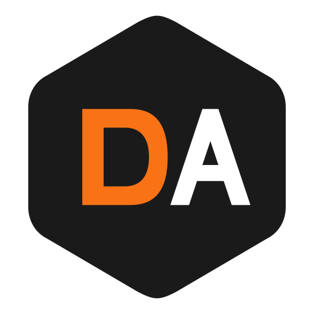
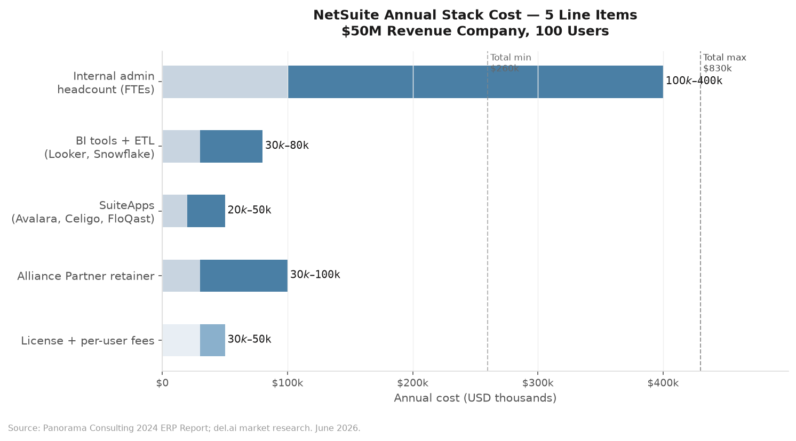
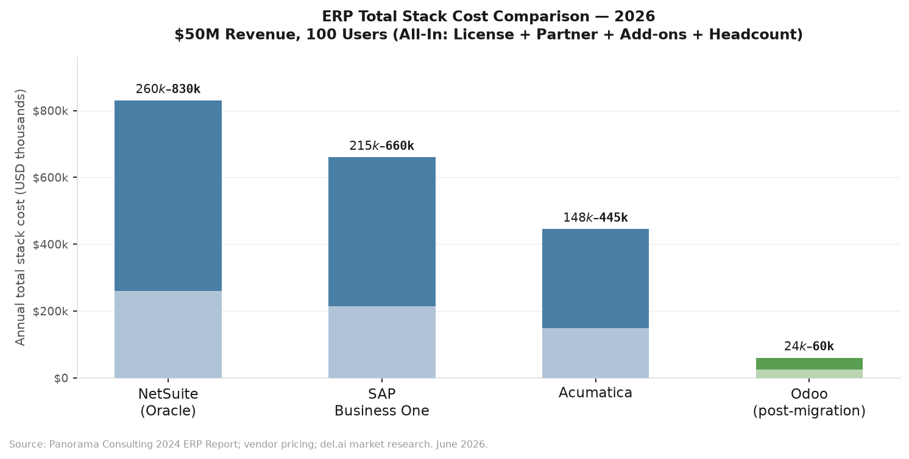

  

<h2 align="center">NetSuite Stack Tax</h2>

  Your NetSuite license is $45k. Your actual bill is $260k–$830k.

  
  
  
  
  
  

---

## What's in this repo

| Folder | What you get |
|--------|-------------|
| [`templates/`](templates/) | CFO renewal math, migration checklist, board talking points |
| [`data/`](data/) | ERP cost CSV (2026), renewal escalation history, AI agent requirements matrix |
| [`research/`](research/) | Why AI fails on closed ERP, Alliance Partner economics, academic citations |

---

## The Stack Tax Problem

Most CFOs sign a NetSuite contract at $30k–$50k/yr and call it their ERP cost.

That number is missing four more line items:

| Line item | Annual cost |
|-----------|-------------|
| License + per-user fees | $30,000 – $50,000 |
| Alliance Partner retainer | $30,000 – $100,000 |
| SuiteApps (Avalara, Celigo, FloQast) | $20,000 – $50,000 |
| BI tools + ETL (Looker, Snowflake) | $30,000 – $80,000 |
| Internal NetSuite admin headcount | $100,000 – $400,000 |
| **Total annual stack cost** | **$260,000 – $830,000** |

The license is the smallest line item. The stack is what kills you.

**Source:** Panorama Consulting 2024 ERP Report; del.ai market research.

---

## The 5-Year Cost of Staying

For a company with a $120k/yr NetSuite stack at 8% annual escalation:

| Year | Annual cost |
|------|-------------|
| Year 1 | $120,000 |
| Year 2 | $129,600 |
| Year 3 | $139,968 |
| Year 4 | $151,165 |
| Year 5 | $163,258 |
| **5-year total** | **$703,991** |

Migration to Odoo via del.ai: starts at $50,000 (one-time) + $24,000–$60,000/yr post-migration.

**5-year savings: $534,000+** on a $120k starting stack (vs. $24k/yr Odoo post-migration).

---

## Why AI Fails on NetSuite

AI agents need five primitives to work in production:

| Primitive | NetSuite | Odoo |
|-----------|----------|------|
| Schema access | ⚠️ Partial (API subset only) | ✅ Full (PostgreSQL direct) |
| Write capability | ⚠️ Limited (rate-limited, field restrictions) | ✅ Full (ORM + direct write) |
| Canonical ontology | ❌ 3 naming systems, no consistency | ✅ ORM enforces consistency |
| Real-time events | ❌ No native webhooks | ✅ PostgreSQL LISTEN/NOTIFY |
| Code extensibility | ❌ SuiteScript sandbox | ✅ Python, no gating |

Full analysis: [`research/why-ai-fails-on-erp.md`](research/why-ai-fails-on-erp.md)
Data: [`data/ai-agent-erp-requirements.csv`](data/ai-agent-erp-requirements.csv)

---

## ERP Cost Comparison (2026)

Annual total stack cost, $50M revenue company, 100 users:

| ERP | Min | Max |
|-----|-----|-----|
| NetSuite | $260,000 | $830,000 |
| SAP Business One | $215,000 | $660,000 |
| Acumatica | $148,000 | $445,000 |
| **Odoo (via del.ai)** | **$24,000** | **$60,000** |

Full dataset: [`data/erp-cost-2026.csv`](data/erp-cost-2026.csv)

---

## Alliance Partner Economics

Your Alliance Partner earns an estimated 10–25% commission on your NetSuite ACV at renewal — paid by Oracle. On a $120k ACV, that's $12k–$30k/yr they earn for not pushing back on your renewal price.

Full analysis: [`research/alliance-partner-economics.md`](research/alliance-partner-economics.md)

---

## Use This Repo

**CFO / Controller:**
- Download [`templates/renewal-math.md`](templates/renewal-math.md) for your board deck
- Use [`templates/board-talking-points.md`](templates/board-talking-points.md) to frame the migration decision

**NetSuite Admin / IT:**
- See [`templates/migration-checklist.md`](templates/migration-checklist.md) for the 90-day parallel-run process
- Read [`research/why-ai-fails-on-erp.md`](research/why-ai-fails-on-erp.md) before your next AI pilot

**Questions?** Open a [discussion](https://github.com/usedel-ai/netsuite-stack-tax/discussions).

---

## About del.ai

[del.ai](https://usedel.ai) migrates mid-market companies ($30M–$300M revenue) from NetSuite to Odoo in 90 days at a fixed price.

- Fixed price — no change orders
- Parallel run — NetSuite stays live throughout, zero cutover risk
- AI agents included — two production agents deployed at go-live
- You own the code — Odoo is LGPL, your codebase is yours after migration

Built by Patrick Xie, CEO del.ai · [usedel.ai](https://usedel.ai) · [LinkedIn](https://www.linkedin.com/)

---

*Data current as of June 2026. Sources in [`data/sources.md`](data/sources.md). MIT License.*